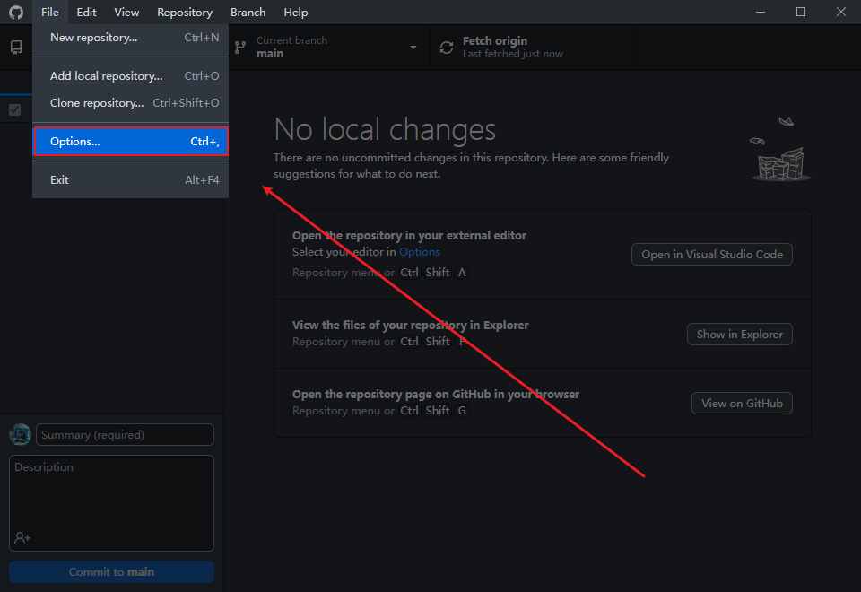
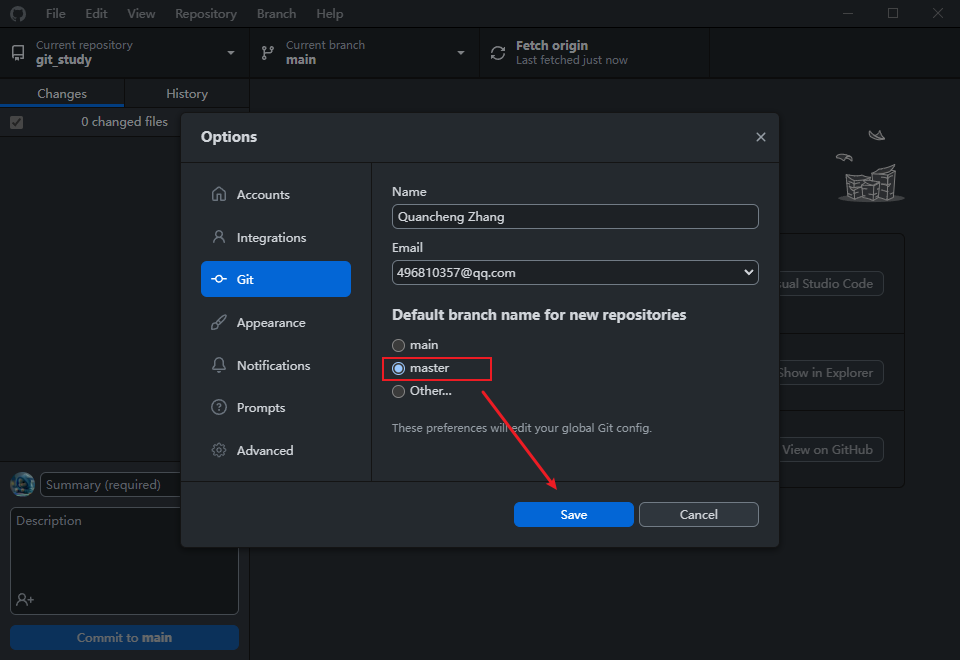
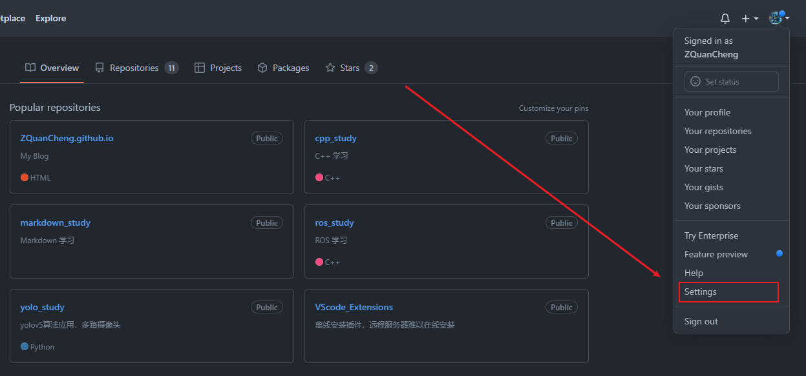
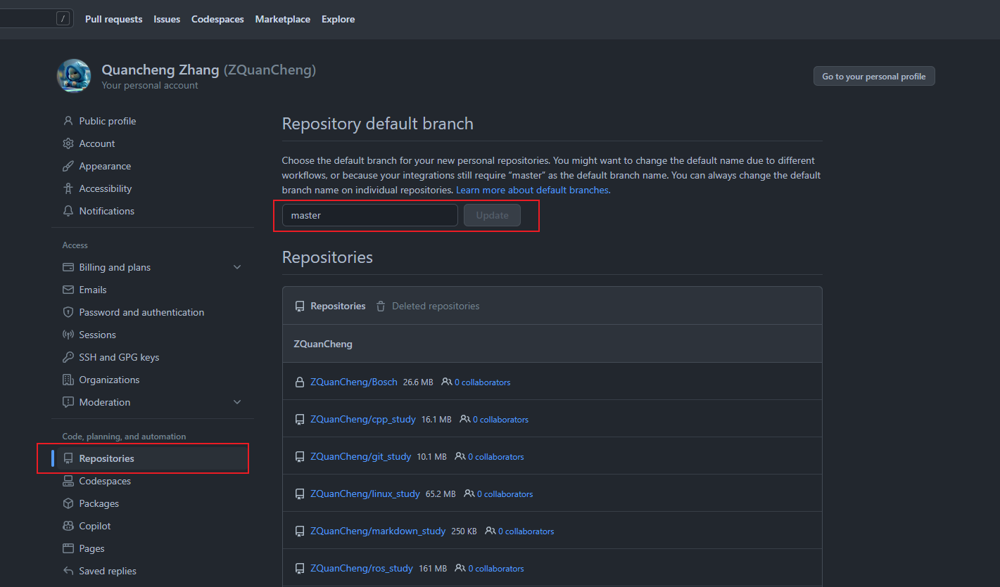
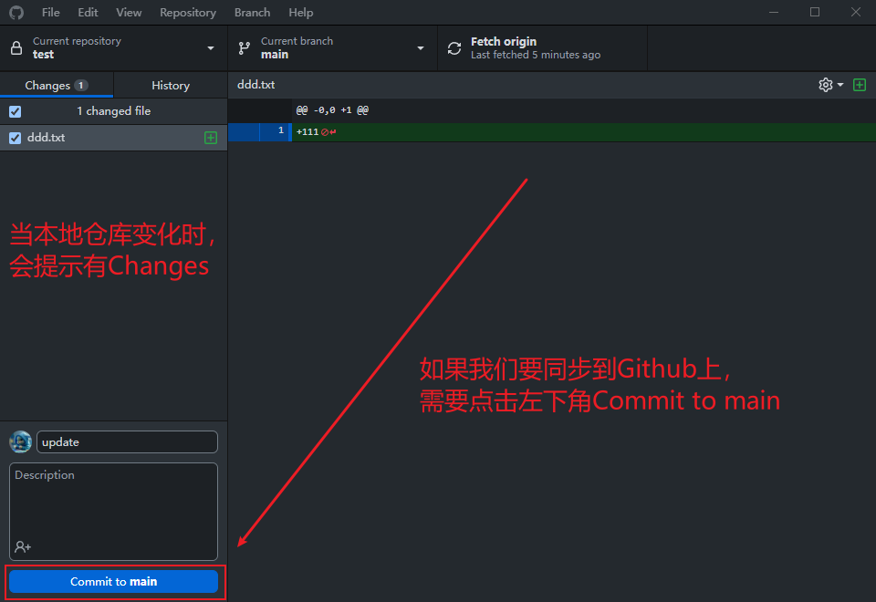
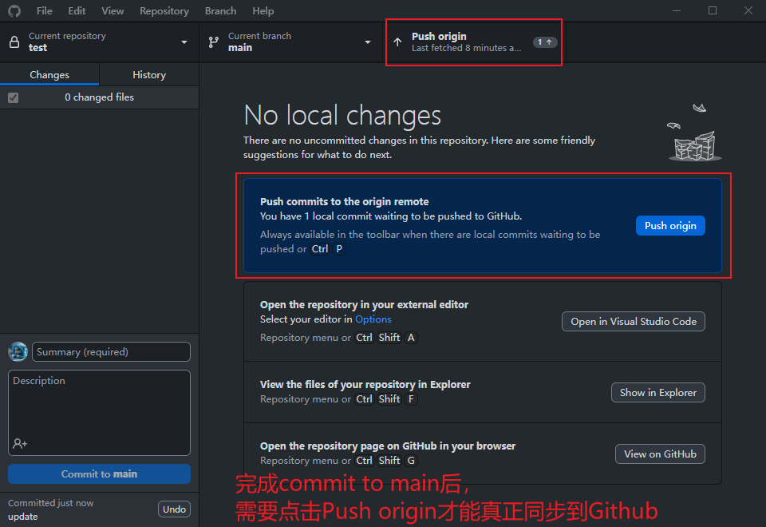
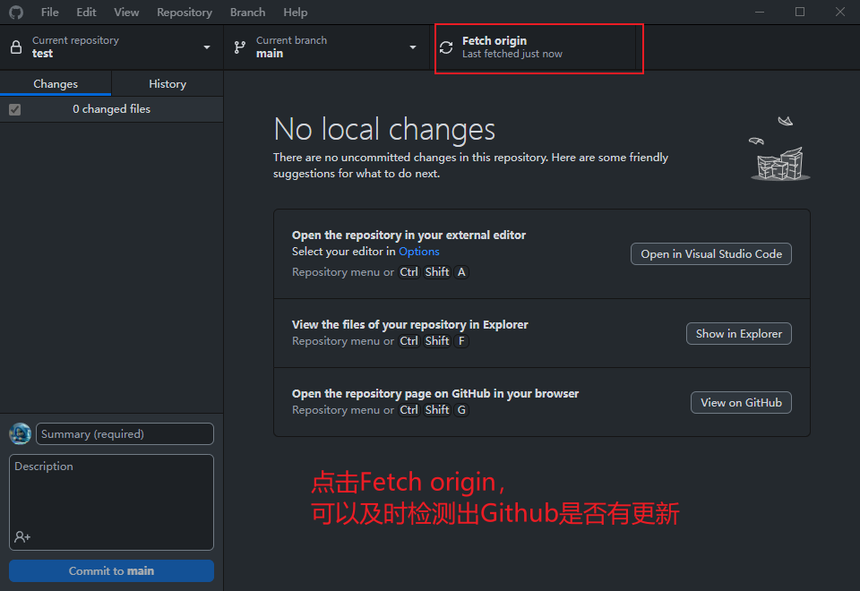
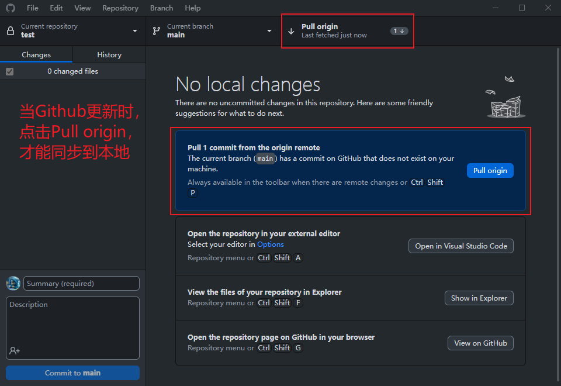

> <font color="yellow"> 将Github的默认分支设置为master，而不是main </font>
> 
> github在2020/10/1宣布上的所有新库都将用中性词【main】命名，取代原来的【master】
> 
> 但是我们都习惯是master，包括很多开源代码
> 
> * <font color="yellow"> Local 本地修改 </font>
> 
> <div align=center>
> 
> 
> </div>
> 
> * <font color="yellow"> Github 远程服务器修改 </font>
> 
> <div align=center>
> 
> 
> </div>
> 


> <font color="yellow"> 我们重新建立所有仓库，分支名自动设置为master </font>
> 
> 虽然Github 远程服务器，可以直接修改默认分支名。但是Local 本地修改后，也无法真正同步，总是有BUG。
>
> 所以我们删除原有仓库，重新在本地建立后，push到远程服务器
> 
> 


> <font color="yellow">Github Desktop的几种图形化按钮都对应哪些git命令？</font>
> ```bash
> * commit to main    # 把改动提交到本地的main分支
> 
> * push origin       # 把本地的改动同步到服务器
> 
> * Fetch origin      # 
> 
> * pull origin
> ```


> <font color="yellow"> commit to main </font>
> <div align=center>
> 
> </div>
>
> 

> <font color="yellow"> push origin </font>
> <div align=center>
> 
> </div>
>
> **push commits to the origin remote**
> You have 1 local commit waiting to be pushed to Github.


> <font color="yellow"> fetch origin </font>
> <div align=center>
> 
> </div>
>
> 

> <font color="yellow"> pull origin </font>
> <div align=center>
> 
> </div>
>
> **Pull 1 commits from the origin remote**
> The current branch（`main`） has commits on Github that do not exist on your machine.
> 

